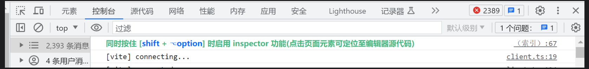

# 提效工具 Code Inspector 的使用

## 主要功能

点击页面上的 DOM 元素，它能自动打开 IDE 并将光标定位至 DOM 的源代码位置。

## 配置方法

如果项目团队成员使用不同的 IDE，使用 editor 参数指定可能会彼此冲突，所以更推荐使用 `.env.local` 文件指定。

### .env.local 文件中指定 editor 参数

指定 IDE 为 cursor 可以指定为其他IDE的编码值，例如：
- Visual Studio Code: `code`
- WebStorm: `webstorm`

```
CODE_EDITOR=code
```

## 使用方式

在页面上按住组合键时，鼠标在页面移动即会在 DOM 上出现遮罩层并显示相关信息，点击一下将自动打开 IDE 并将光标定位到元素对应的代码位置。

- Mac 系统默认组合键: `Option + Shift`
- Windows 系统默认组合键: `Alt + Shift`

> 在浏览器控制台会输出相关组合键提示

## 参考资料

官方使用文档：[https://inspector.fe-dev.cn/]